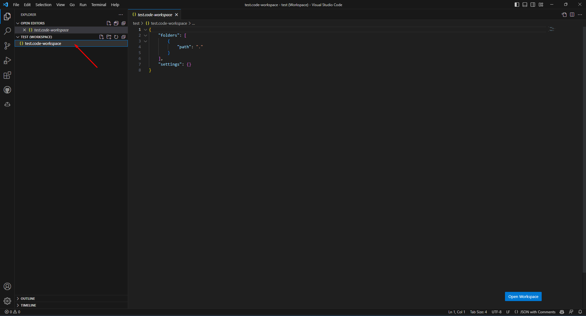
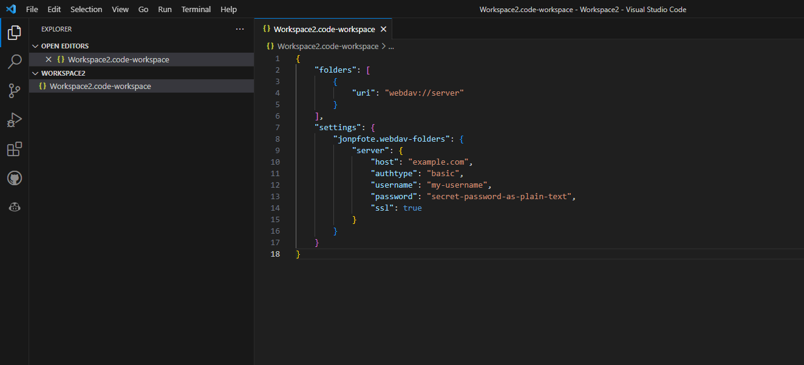

# WebDAV avec Visual Studio Code

> Auteur de la page: Thomas.

---

### Informations

* Auteurs de l'extension: Jonpfote

## Étape 1 : Installation de l'extension

1. Ouvrez Visual Studio Code

2. Cliquez sur l'icône des extensions dans la barre latérale gauche


3. Recherchez "WebDAV" et installez l'extension "WebDAV Folders" de Jonpfote


## Étape 2 : Créez un espace de travail

1. Créez un dossier dans lequel vous souhaitez stocker vos fichiers

2. Ouvrez le dossier dans Visual Studio Code

3. Cliquez sur "File" dans la barre du menu supérieure et sélectionnez "Save Workspace As..."

4. Enregistrez le fichier ".code-workspace" dans le dossier que vous avez créé

5. Selectionnez le fichier ".code-workspace" dans l'explorateur de fichiers de Visual Studio Code




## Étape 3 : Configuration de l'extension

1. Dans le fichier ".code-workspace", ajoutez les lignes suivantes :

```json
{
	"folders": [
        {
            "uri": "webdav://server"
        }
    ],
    "settings": {
        "jonpfote.webdav-folders": {
            "server": {
                "host": "example.com",
				"authtype": "basic",
				"username": "my-username",
				"password": "secret-password-as-plain-text",
				"ssl": true
            }
        }
    }
}
```

2. Remplacez les valeurs suivantes :

* `host` : Adresse du serveur
* `username` : Votre nom d'utilisateur
* `password` : Votre mot de passe (en clair)

3. Enregistrez le fichier (Ctrl + S)



4. Redémarrez Visual Studio Code


## Étape 4 : Utilisation de l'extension

1. Cliquez sur "File" dans la barre du menu supérieure et sélectionnez "Open Workspace from File..."


2. Sélectionnez le fichier ".code-workspace" que vous avez créé


3. Vous pouvez maintenant utiliser Visual Studio Code pour modifier les fichiers sur votre serveur WebDAV.


{docsify-updated}
